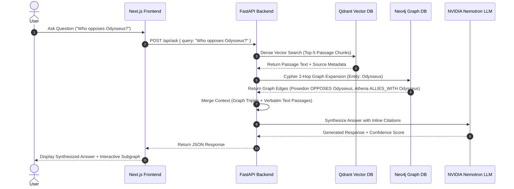

# System Architecture Specification: Lore Engine

## 1. High-Level Architecture Overview

Lore Engine is a multi-modal **Graph-Augmented Retrieval Generation (GraphRAG)** system designed to ingest, extract, index, and query cross-referencing mythological narrative corpora.

```
                              +---------------------------------------+
                              |         Next.js 15 Frontend           |
                              |  (React 19, Tailwind CSS, SVG Canvas) |
                              +-------------------+-------------------+
                                                  |
                                                  v REST / HTTP JSON
                              +-------------------+-------------------+
                              |          FastAPI Backend              |
                              |     (Router, Pydantic, Middleware)    |
                              +---------+-------------------+---------+
                                        |                   |
                       +----------------+                   +----------------+
                       | Cypher Queries                     | Vector Search  |
                       v                                    v                v
        +--------------+--------------+      +--------------+--------------+ |
        |     Neo4j Graph Database    |      |    Qdrant Vector Database   | | Embeddings
        | (Nodes: Character, Source)  |      | (Dense Chunks & Metadata)   | |
        | (Edges: PARENT_OF, OPPOSES) |      +-----------------------------+ |
        +-----------------------------+                                      |
                                                                             v
                                                              +--------------+--------------+
                                                              |    NVIDIA Nemotron LLM      |
                                                              |   (Relation Extractor)      |
                                                              +-----------------------------+
```

---

## 2. Extraction Pipeline Architecture

### Resilient Extraction Mechanics (`relation_extractor.py`)
1. **Passage Chunking:** Text documents are segmented into overlapping 500-token sliding windows (`homer_iliad`, `homer_odyssey`, `hesiod_theogony`, `ovid_metamorphoses`).
2. **AIMD Adaptive Rate Limiter:** Operates an Additive Increase / Multiplicative Decrease algorithm:
   - **Success Condition:** +1 RPM for every 10 consecutive success responses (up to 27 RPM ceiling).
   - **429 Rate Limit Condition:** -30% RPM drop (down to 10 RPM floor).
3. **Circuit Breaker State Machine:** Trips to `OPEN` state after 5 consecutive 429/503 HTTP exceptions, forcing a 30-second cooldown period before probing resume.
4. **4-Stage Resilient JSON Parser:**
   - *Stage 1:* Direct `json.loads` parsing.
   - *Stage 2:* Markdown fence stripper (` ```json ... ``` `).
   - *Stage 3:* Substring regex matcher (`r'\[\s*\{.*\}\s*\]'`).
   - *Stage 4:* Python dict pair regex extractor (`r'\{[^{}]*\}'`).
5. **Entity Normalization & Validation:** Pronouns, single-character tokens, and `INVALID_ENTITIES` (`thou`, `ye`, `he`, `she`, `they`) are stripped before writing to disk.

---

## 3. GraphRAG Retrieval & Context Merging Workflow



---

## 4. Contradiction Resolution Rules Engine

Structural narrative contradictions between source traditions are computed using deterministic Cypher queries rather than unconstrained LLM prompts:

1. **Disputed Parentage Rule (`DISPUTED_PARENTAGE_QUERY`):**
   ```cypher
   MATCH (p1:Character)-[r1:PARENT_OF]->(c:Character)<-[r2:PARENT_OF]-(p2:Character)
   WHERE p1 <> p2 AND r1.source <> r2.source
   RETURN c.name AS child, p1.name AS parent1, r1.source AS source1, p2.name AS parent2, r2.source AS source2
   ```

2. **Direct Opposition vs Alliance Rule (`DIRECT_CONTRADICTION_QUERY`):**
   ```cypher
   MATCH (a:Character)-[r1:ALLIES_WITH]->(b:Character), (a)-[r2:OPPOSES]->(b)
   WHERE r1.source <> r2.source
   RETURN a.name AS entityA, b.name AS entityB, r1.source AS allianceSource, r2.source AS oppositionSource
   ```
